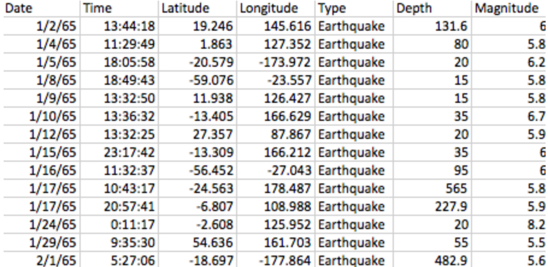

## Module Aardrijskunde Les 1 Werkblad a

### Handmatig aardbevingen plotten

Aan het einde van de les kun jij:

- data over aardbevingen leren begrijpen
- aardbevingen handmatig plotten op wereldkaart

**Instructie leerlingen**
In deze lessen ga jij zelf data over aardbevingen op een wereldkaart afbeelden. Het einddoel van deze lessen is zoiets:

De vierkantjes zijn aardbevingen, en grotere vierkanten zijn ergere aardbevingen (met een hogere magnitude). Maar jouw plaatje wordt vast mooier!
Voor we gaan programmeren, gaan we de opdracht eerst met pen en papier uitvoeren. Je doet deze opdracht in groepjes van 3.  

Je hebt een wereldkaart gekregen. Daar ga je data op tekenen. 

Je hebt ook de data op papier gekregen:

De kolommen van de data betekenen (in de volgorde dat je ze leest):

1. De datum van de aardbeving
2. De tijd
3. De latitude of breedtegraad (https://nl.wikipedia.org/wiki/Breedtegraad)
4. De longitude of lengtegraad (https://nl.wikipedia.org/wiki/Lengtegraad)
5. Wat de oorzaak van de beving is, een aardbeving (Earthquake) of een kernbom (Nuclear Explosion)
6. De diepte
7. De magnitude op de schaal van Richter (https://nl.wikipedia.org/wiki/Schaal_van_Richter)

We beginnen met het tekenen van de eerste aardbeving. 
Die vond plaats op 19.246, 145.616. Dus het eerste wat we gaan doen is de goede plaats op de kaart opzoeken. Daarvoor zetten we eerst wat hulpstreepjes.
Latitude gaat van -90 tot 90, dus de hele hoogte van de kaart heeft 180 eenheden. Op 0, in het midden, ligt de evenaar. Een A3 afbeelding van de kaart is 297mm hoog. Voor het gemak rekenen we even met 300 mm.  Dus de helft van de kaart, 90 graden, is 150mm.

**Opdracht 1)**
Teken jij de evenaar op de kaart?

**Opdracht 2)** 
Teken daarna, aan de rand van de kaart, 5 streepjes op jouw kaart, steeds op 50 mm van elkaar. Die geven dus -60, -30, 0 (de evenaar, daar heb je al een streep), 30 en 60 aan.

**Opdracht 3)** 
Je hebt nu 6 horizontale vlakken. In welk vlak ligt 19 graden?

Nu doen het hetzelfde voor de longitude. Die gaat van -180 tot 180 graden, dus 360 eenheden. Een A3 is 420mm breed. 

**Opdracht 4)** 
Zet jij een verticale streep in het midden van het vel, bij 0 graden?
Verdeel nu ook in 6 verticale vlakken. Zet dus streepjes bij -120, -60, 0, 60 en 120 graden. De streepjes zitten steeds 70mm van elkaar.

**Opdracht 5)** 
Je hebt nu 6 verticale vlakken. In welk vlak ligt 145 graden?
Als je het goede vlak hebt gevonden, probeer dan de positie zo precies mogelijk te vinden. Ver er een kleine stipje op.

**Opdracht 6)** 
Vergelijk je stippen met de groep naast je. Is het ongeveer hetzelfde?

Nu moeten we de magnitude nog weergeven. Voor een magnitude van 6, zet je passer op 3cm. Dan krijg je een rondje van 6cm groot. 

**Opdracht 7)** 
Prik je passer in het kleine stipje en maak een rondje. Je mag ook een vierkantje of een driehoekje ter grootte van 6cm tekenen!
Herhaal dit proces nu voor de volgende regel.

Vergelijk op het einde van de les nog eens met de kaart van je buren!

