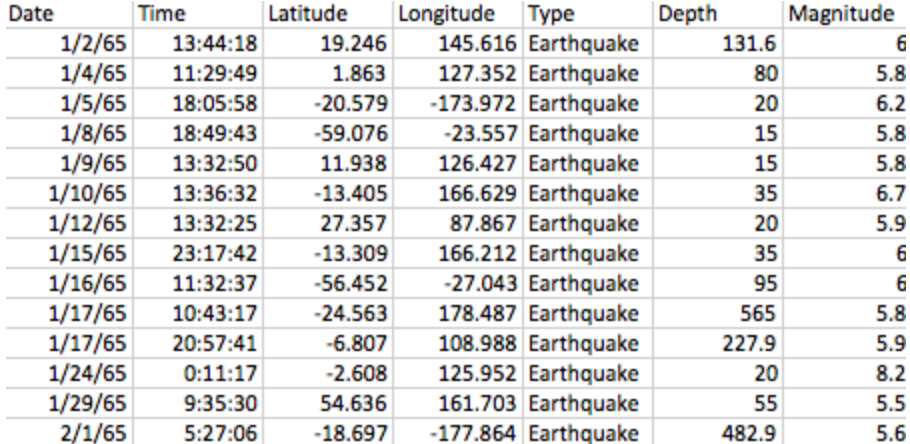
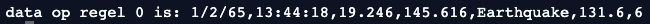

### Module Aardrijskunde Les 3 Werkblad a

### Datatypes omzetten

Aan het einde van de les kun jij:

- Datatype van uitgelezen tekst omzetten
- Alle data voor onze aardbevingen op een bruikbare manier inlezen

**Even opfrissen!**
Vorige week hebben we geleerd hoe we de data van een aardbeving kunnen inlezen in python, en hoe we deze ingelezen data in stukjes kunnen hakken, zodat we bijvoorbeeld iets kunnen vertellen over alléén de magnitude. 

Onderstaand plaatje is een stukje van de data over aardbevingen die in de target_url te vinden is. 



```python
target_url = 'aardbevingen_data.csv' # Dit is 'zogenaamd' de code die aangeeft waar dit bestand terug te vinden is.
```

1) Welke van deze codes leest op de juiste manier de data uit de target_url in en slaat deze op in een variabele genaamd data? Schrijf de goede code over in je schrift!

```python
- data = readlines(target_url)

- data = target_url

- data = readlines
        
- target_url = readlines(data)
```

2) Hoe zorgen we nu dat we alleen de tiende regel inlezen en dit opslaan in een variabele genaamd regel_10? Schrijf de juiste code in je schrift.

3) We willen de aardbeving inlezen die plaatsvond op 29 januari 1965 en deze opslaan in een variabele genaamd aardbeving_29_januari. Schrijf de juiste code waarmee je deze aardbeving kunt inlezen in je schrift.



5) Maak de code hieronder af zodat de data in opgehakte stukjes in een lijst komt te staan.

```python
regel_1 = data[0]

lijst_van_opgehakte_regel_1 = regel_1.split(... ... ...) #vul de missende tekens in op de stippellijnen.
```

6) Hieronder staan vijf codes waarmee een stukje data over de eerste aardbeving uit de afbeelding op de eerste pagina wordt geprint. Er wordt gebruik gemaakt van de variabelen regel_1 en lijst_van_opgehakte_regel_1 die je in opdracht 5 gemaakt hebt. Wat printen deze codes uit? Let op, er staan ook foute codes tussen! 

Schrijf de uitvoer in je schrift.

```python
1. print(lijst_van_opgehakte_regel_1[0])               
```

```python
2. print(regel_1[6])   
```

```python
3. magnitude = lijst_van_opgehakte_regel_1[7]
print(magnitude)
```

```python
4. depth = lijst_van_opgehakte_regel_1[5]
print(depth)
```

```python
5. print(lijst_van_opgehakte_regel_1[6]
```

------

Einde werkblad! Ben je klaar, leg dan je schrift bovenaan op je tafel 


<div style="page-break-after: always;"></div>

------

**Van een String naar een Float**


Om onze wereldkaart met geplotte aardbevingen precies te krijgen zoals wij willen, moeten we de data die we gaan inlezen goed analyseren. We willen zeker weten dat we de data op zo'n manier inlezen, dat de computer er ook echt wat voor kan gaan tekenen op jouw wereldkaart. Dit betekent in ons geval dat we moeten opletten dat de latitude, longtitude en magnitude als een cijfer wordt ingelezen, en niet als tekst.
In het Pythons noemen we dat als Integer, en niet als String. En nog specifieker? Wij willen Floats inlezen, dat zijn kommagetallen! Integers zijn hele getallen, maar zoals je ziet op de kaart zijn veel van de latitude, longtitude en magnitude getallen kommagetallen.

<u>Opdracht</u>

Vul de juiste functienaam in op de puntjes. Neem de stukjes code over in je schrift. De comments hoef je niet over te schrijven.

1) Hoe heet de functie waarmee we een ingelezen stuk tekst kunnen omzetten naar een Integer? 

```python
magnitude = '6' #magnitude is nu een string van het karakter 6
magnitude_als_integer = ...(magnitude) #vul de juiste functienaam in op de puntjes
```

2) Probeer hetzelfde voor een depth waarde. 

```python
depth = '565' #depth is nu een string van de karakters 565
depth_als_integer = ...(depth) #vul de juiste functienaam in op de puntjes
```

3) Hoe heet de functie waarmee we een ingelezen stuk tekst kunnen omzetten naar een Float? 

```python
magnitude = '6.5' #magnitude is nu een string van de karakters 6.5
magnitude_als_float = .....(magnitude) #vul de juiste functienaam in op de puntjes
```

4) Probeer hetzelfde voor een latitude waarde. 

```python
latitude = '-20.579' #latitude is nu een string van de karakters -20.579
latitude_als_float = .....(latitude) #vul de juiste functienaam in op de puntjes
```

Als je deze opdrachten juist hebt ingevoerd weet je hoe je van een String een Integer of een Float waarde kunt maken! **<u>Laten we vanaf nu altijd de functie voor de Float waarde gebruiken</u>**, zodat we niet per ongeluk ergens een foutje gaan maken als we een kommagetal tegenkomen.

5) Voor de zekerheid kun je als programmeur altijd even checken wat voor een type waarde jouw variabele nu bevat. 

```python
print('Het type van latitude is') 
print(....(magnitude)) #vul de juiste functienaam in op de puntjes
```

Als je dit goed doet komt op de computer de volgende tekst in beeld:

```
Het type van latitude is
<type 'float'>
```

6) Oké, we weten nu hoe we datatypes kunnen omzetten. Maar laten we nog even checken of we zelf wel herkennen met wat voor datatype we te maken hebben. Schrijf voor elk van onderstaande regels op om wat voor datatype het gaat

```python
1. '6' 

2. 6

3. 6.0

4. '6.0'

5. -20.579

6. '-20.579'

7. 'magnitude'

```

7)

Wat gebeurt er als we onderstaand stukje code willen uitvoeren?

```python
magnitude = '6'
magnitude_plus_2 = magnitude + 5 
print(magnitude_plus_2)
```

8) 

Wat gebeurt er als we onderstaand stukje code willen uitvoeren?

```python
magnitude = 6
magnitude_plus_2 = magnitude + 5 
print(magnitude_plus_2)
```

9) 

Wat gebeurt er als we onderstaand stukje code willen uitvoeren?

```python
magnitude = 6
magnitude_plus_2 = magnitude + '5' 
print(magnitude_plus_2)
```

10) 

Wat gebeurt er als we onderstaand stukje code willen uitvoeren?

```python
magnitude = '6'
magnitude_plus_2 = float(magnitude) + 5 
print(magnitude_plus_2)
```

11) 

Wat gebeurt er als we onderstaand stukje code willen uitvoeren? *Let goed op bij deze!* 

```python
magnitude = '6.5'
magnitude_plus_2 = int(magnitude) + 5 
print(magnitude_plus_2)
```

**Datatypes <u>correct</u> inlezen**

We gaan nu de kennis van de afgelopen lessen bij elkaar voegen, zodat we na deze les er helemaal klaar voor zijn om met het visueel plotten van onze aardbeving aan de slag te gaan! We werken nogmaals met de  data uit het aardbevingen bestand. 


```python

```

<u>Opdracht</u>

1) Maak de code hieronder af zodat de data van de tweede regel in.  opgehakte stukjes in een lijst komt te staan. Dat is de aardbeving die op 1/4/65 plaatsvond. Dit hebben we al een paar keer geoefend.

```python
target_url = 'aardbevingen_data.csv' # Dit is 'zogenaamd' de code die aangeeft waar dit bestand terug te vinden is.

data = .........(target_url)

regel_1 = data[...]

lijst_van_opgehakte_regel_1 = regel_1.split(... ... ...) #vul de missende tekens in op de stippellijnen.
```

Lees nu voor elk van de kolommen de data van de tweede regel in. Dat is de aardbeving die op 1/4/65 plaatsvond. Gebruik hiervoor de het resultaat wat in het stukje hierboven in regel_1 staat. Overal waar puntjes staan mist nog code die jij moet invullen. Neem alles over in je schrift.

```python
1. date = lijst_van_opgehakte_regel_1[...] 

2. time = lijst_van_opgehakte_regel_1[...]

3. latitude = ....(lijst_van_opgehakte_regel_1[...])

4. longtitude = ....(.........................[3])

5. type = ........................[4]

6. depth = ....(lijst_van_opgehakte_regel_1[...])

7. magnitude = ....(lijst_van_opgehakte_regel_1[...])
```

------

Einde werkblad! Ben je klaar, leg dan je schrift bovenaan op je tafel 

------

