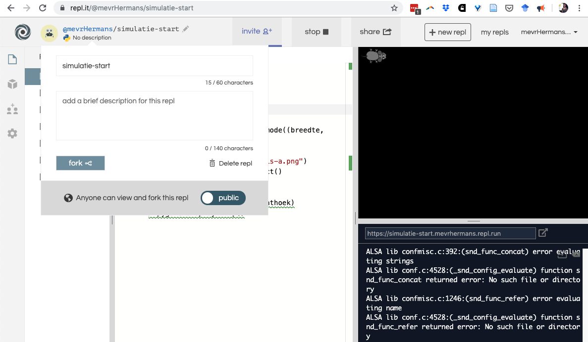

### Fork de simulatie in repl.it 

Deze opdracht wordt afgetekend als:

- Je naar https://repl.it/@mevrHermans/simulatie-start bent gegaan
- Je dit programma 'geforkt' hebt met de fork knop.

**Uitleg**

Klik op het potloodje naast de naam van het programma. Klik dan op de grijze knop met fork erop. Je hebt nu een kopie van het programma gemaakt. Dat wordt vanzelf opgeslagen zodat je er steeds aan door kan werken.




### Laad het plaatje van een muis in

Deze opdracht wordt afgetekend als:

* Het hele scherm zwart is
* Je in Pygame een muis hebt geladen
* Je in je schrift hebt opgeschreven welke variabelen je tot nu toe in je programma hebt gebruikt (tip: een variabele staat altijd links van een =)

**Uitleg**

Er staat al wat code voor je klaar. Je moet twee dingen aanpassen.

```py
breedte = 800
hoogte = __

screen = pygame.display.set_mode((breedte, hoogte))

muis = pygame.image.load('leeg.png')
```

1) Als eerste pas je de grootte van het scherm aan bij hoogte en breedte. Je hoeft alleen een getal op de streepjes te zetten. Kijk eens goed naar het scherm. Wat is meer, de grootte of de breedte? Als de breedte 800 is wat zou dan (ongeveer) de hoogte zijn?

2) Als tweede ga je het plaatje van de muis inladen. Kijk links naar alle bestanden die je hebt. Klik eens op `'leeg.png'` dat is het bestand dat nu wordt ingeladen. Dat is een wit vlak. Zoek de afbeelding van de muis en laadt die in door de bestandsnaam in te vullen waar nu leeg.png staat.

### Laat de muis bewegen

Deze opdracht wordt afgetekend als:

- De muis over het scherm beweegt
- Je hiervoor time.sleep() gebruikt.
- Jij in je schrift hebt uitgelegd hoe de variabele snelheid werkt

**Uitleg**

Nu ga je de muis laten bewegen. Daarvoor gaan we 3 stappen zetten.

1) Maak een variabele snelheid op regel 11, dat is boven de regel met `while True`:

Snelheid is een lijst met daarin 2 getallen. Zet die op 1 en 0. Let op! Het zijn getallen, dus we gebruiken geen aanhalingstekens.

2) Helemaal onderaan je code zet je nu deze regel: 
`muis_rechthoek = muis_rechthoek.move(snelheid)`

Let op! Deze regel staat in de lus van `while True`, dus die moet beginnen met 4 spaties.

3) Onder de nieuwe regel zet je `time.sleep(0.1)` Dat zorgt ervoor dat het programma even wacht met bewegen. Anders gaat de muis veel te snel vooruit. Ook deze regel moet beginnen met 4 spaties.

Als dit gelukt is, probeer dan eens andere getallen in de snelheid in te vullen. Snap jij hoe het werkt? Schrijf het dan duidelijk op in je schrift.

Tip: het is niet erg als de muis na een tijdje uit beeld verdwijnt! Dat lossen we later nog wel op.

### Nu de leeuw

Deze opdracht wordt afgetekend als:

- Je in je schrift hebt opgeschreven welke regels van je programma over de muis gaan (alleen de nummers)
- Je per regel opschrijft wat je denkt dat de regel doet
- Je ook een leeuw in beeld krijgt

**Uitleg**

Kijk eens goed welke regels in je programma iets doen met een muis. Schrijf de nummers op in je schrift en bestudeer ze eens goed. 

Schrijf nu eens per regel op wat er ongeveer gebeurt. Je mag hier best Google bij gebruiken als je het niet meteen precies weer.

Nu ga je proberen ook een leeuw in te laden. Het plaatje van de leeuw heet `'leeuw-a.png'`.

### Laat nu ook de leeuw bewegen

Deze opdracht wordt afgetekend als:

- Je twee variabeles hebt gemaakt voor de snelheid: eentje voor de muis en eentje voor de leeuw
- De leeuw ook beweegt

**Uitleg**

Ook de leeuw moet bewegen. Daarvoor moet je de regel met `move(snelheid)` erin kopiëren. Maar let op! Ieder dier heeft een eigen snelheid nodig. Een leeuw is natuurlijk veel sneller dan een muis. Volg deze stappen:

1) Verander de naam van snelheid in `snelheid_muis`. Jet makkelijkste is om dat te doen met de computermuis. Selecteer snelheid en duw dan op F2. Als je nu een nieuwe naam invoert dan verandert het vanzelf overal.

2) Maak een nu een nieuwe variabele `snelheid_leeuw`, en gebruik die in je nieuwe regel met move erin.

### Doe onderzoek voor jouw eigen simulatie

Deze opdracht wordt afgetekend als:

- Je twee dieren hebt gekozen die in jouw simulatie voor gaan komen
- Je voldoende onderzoek hebt gedaan over de snelheid en leefsituatie van die dieren. Denk bijvoorbeeld aan: snelheid, leefstijl (alleen of in een groep), voedsel, waterbehoefte.
- Je deze informatie hebt samengevat in je schrift

**Uitleg**

Later in de lessenserie gaan we de leeuw en de muis veranderen in dieren die jij mag kiezen. Als je klaar bent met de programmeeropdrachten mag je informatie gaan zoeken over dieren. Kies twee dieren uit waarvan de een de andere opeet. Zoek ook genoeg uit over de leeromgeving van de dieren.