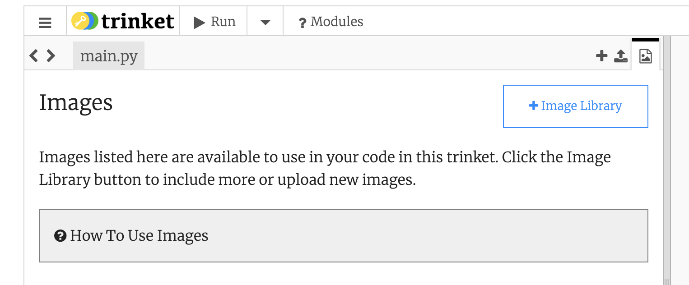

## Werkblad, versie groep 009

### 1) Account aanmaken op Trinket

Deze opdracht wordt afgetekend als:

- Je een account hebt aangemaakt op Trinket.io
- Je je emailadres van school hebt gebruikt als username
  - Bijv. 123456@student.lmc-vo.nl

**Opdracht.** Omdat repl.it steeds vastloopt, gaan we overstappen op een ander systeem. Maak een account zodat je ook daar je code kan opslaan. 
Gebruik je emailadres van school als username zodat je die niet vergeet!!
Kies ook een wachtwoord dat je kan onthouden!

###2) Functie maken voor 'ik zag twee beren'

Deze opdracht wordt afgetekend als:

- Je in Trinket code kan runnen
- Je een functie hebt gemaakt voor het liedje 'ik zag twee beren'
- Je drie coupletten print, een met beren en smeren, een met vliegen en wiegen, en eentje voor een dier en een activiteit die je zelf kiest.

**Opdracht.** Ga naar deze code: https://felienne.trinket.io/sites/beren

Maak nu een fuctie voor het printen van het liefddje, met twee argumenten, precies zoals we in de klas geoefend hebben.

###3) Terug naar de simulatie

Deze opdracht wordt afgetekend als:

- Je je dieren hebt gedownload 
- Je je dieren in Trinket hebt geupload.

**Opdracht.** We gaan nu in Trinket verder werken. We hebben al een simulatie voor je klaar gezet.

Je gaat je simulatie zoals je die al had zelf omzetten, volg daarvoor deze stappen:

1. Log in op repl.it en download je plaatjes

2. Log in op Trinket en ga naar: https://trinket.io/python/ffa2308b6c

3. Klik op Remix rechtsbovenaan om deze code op te slaan:

   

4. Ga naar het laatste tabje en upload je plaatjes daar:

   

5. Pas de code zo aan dat een van jouw plaatjes wordt ingeladen

###4) Maak de functie voor 'omdraaien' (als je dit nog niet had)

Deze opdracht wordt afgetekend als:

- Je in je schrift de overeenkomsten en verschillen tussen de 2 stukken code hebt opgeschreven.
- Je een functie hebt gemaakt voor omdraaien aan de rand.

Ook in je Trinket-programma zit weer veel herhaling. We hebben net goed geoefend om functies te maken, dat kun jij nu ook in jouw simulatie-code! Bijv. deze code:

```python
---- stukje 1 ----
  muis_x, muis_y = muis.position()
  
  if muis_x > 100:
    muis.left(90)

  if muis_x < -100:
    muis.left(90)
     
  if muis_y > 150:
    muis.left(90)
    
  if muis_y < -150:
    muis.left(90)
    
---- stukje 2 ----
  leeuw_x, leeuw_y = leeuw.position()
  
  if leeuw_x > 100:
    leeuw.left(90)

  if leeuw_x < -100:
    leeuw.left(90)
     
  if leeuw_y > 150:
    leeuw.left(90)
    
  if leeuw_y < -150:
    leeuw.left(90)
```
Pas de stappen weer toe:

1. Omcirkel de code die hetzelfde is
2. Onderstreep wat **niet** hetzelfde is
3. Maak een functie met wat hetzelfde is, maar... wat **niet** hetzelfde is, wordt een variabele!
4. Vervang de omcirkelde code door de *functieaanroep* zingen_voor_jarige() met tussen de haakjes het onderstreepte woord!

De functie begint zo:

```python
def draai_om_aan_de_rand(dier):
  dier_x, dier_y = dier.position()
  
  if dier_x > 100:
    dier.left(90)

  # hier komt de rest van de code 
```

Maak jij de code af?

###5) Collision detection

Deze opdracht wordt afgetekend als:

- Je roofdier je prooidier weer op kan eten

Ook in Trinket kun je kijken of twee dieren elkaar aanraken. Dat doe je door de afstand tussen twee dieren te meten, met de distance functie van het ene dier, met als argument het andere dier: 

```python
  if leeuw.distance(muis) < 50: #pas het getal 50 eventueel aan, afhankelijk van de grootte van je plaatjes
    print('hap hap')
    muis.hideturtle()
    muis.goto(__, __) #zorg hier dat het dier naar een willekeurige plek verplaatst
    muis.showturtle()
```
Dit stukje code moet elke tijdstap worden uitgevoerd, dus het moet terechtkomen in de While-lus.

### 6) Eigen stempeldoel 

Deze opdracht wordt afgetekend als:

- Je zelf een doel hebt bedacht, en dat hebt uitgevoerd

**Uitleg.** Verzin zelf iets wat er nog bij kan in je simulatie. Een achtergrond? Een extra dier? Een kangoeroe met een bokshandschoen? Bedenk iets en schrijf dat in je schrift. Voer het vervolgens netjes uit. Vraag wel eerst of mevr. Hermans of meneer van Oijen je doel goed vindt.


