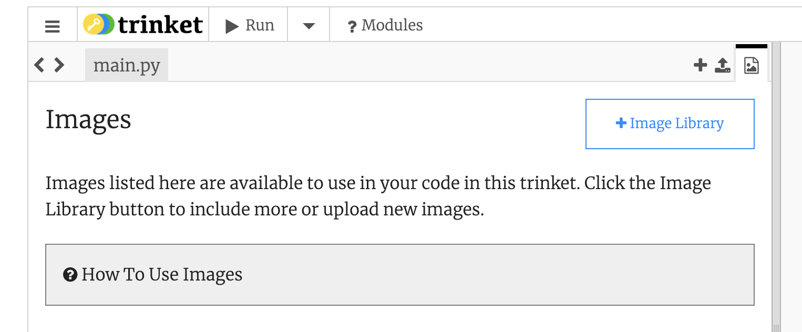

## Werkblad, versie groep 011

### 1) Account aanmaken op Trinket

Deze opdracht wordt afgetekend als:

- Je een account hebt aangemaakt op Trinket.io
- Je je emailadres van school hebt gebruikt als username
  - Bijv. 123456@student.lmc-vo.nl

**Opdracht.** Omdat repl.it steeds vastloopt, gaan we overstappen op een ander systeem. Maak een account zodat je ook daar je code kan opslaan. 
Gebruik je emailadres van school als username zodat je die niet vergeet!!
Kies ook een wachtwoord dat je kan onthouden!

###2) Code omzetten

Deze opdracht wordt afgetekend als:

- Je je simulatie zoals die was in Trinket werkt

Je gaat je simulatie zoals je die al had zelf omzetten, volg daarvoor deze stappen:

1. Log in op repl.it en download je plaatjes

2. Log in op Trinket en maak een nieuw programma aan (Python)

3. Kopieer de code voor 1 dier van deze Trinket: https://trinket.io/library/trinkets/5443f7ed7b

4. Ga naar het laatste tabje en upload je plaatjes daar:

   

5. Pas de code zo aan dat een van jouw plaatjes wordt ingeladen

6. Pas de code nu zo aan dat ook de andere elementen uit je simulatie toegevoegd worden, zoals een tweede of derde dier, een achtergrond etc.

###3) Maak de functie voor 'omdraaien' (als je dit nog niet had)

Deze opdracht wordt afgetekend als:

- Je in je schrift de overeenkomsten en verschillen tussen de 2 stukken code hebt opgeschreven.
- Je een functie hebt gemaakt voor omdraaien aan de rand.

Ook in je Trinket-programma zit weer veel herhaling, dat betekent veel code die op elkaar lijkt. 
We willen liever code die twee of drie keer voorkomt in een **functie** zetten. Bijvoorbeeld deze twee stukken code:

```python
---- stukje 1 ----
  muis_x, muis_y = muis.position()
  
  if muis_x > 100:
    muis.left(90)

  if muis_x < -100:
    muis.left(90)
     
  if muis_y > 150:
    muis.left(90)
    
  if muis_y < -150:
    muis.left(90)
    
---- stukje 2 ----
  leeuw_x, leeuw_y = leeuw.position()
  
  if leeuw_x > 100:
    leeuw.left(90)

  if leeuw_x < -100:
    leeuw.left(90)
     
  if leeuw_y > 150:
    leeuw.left(90)
    
  if leeuw_y < -150:
    leeuw.left(90)
```
Hier gaan we weer een functie maken. De begint zo:

```python
def draai_om_aan_de_rand(dier):
  dier_x, dier_y = dier.position()
  
  if dier_x > 100:
    dier.left(90)

  # hier komt de rest van de code 
```

Maak jij de code af?

###4) Gebruik de functie voor 'omdraaien'

Deze opdracht wordt afgetekend als:

- Je de nieuwe functie gebruikt voor het omdraaien aan de rand van **beide** dieren.

Nu je de functie hebt gemaakt, moet je deze ook om in je code "aanroepen". 

Deze code heb je al, alles met een #weg erachter mag je nu verwijderen, en vervangen door de functieaanroep: `draai_om_aan_de_rand(muis)`

```python
while True: 
  muis.forward(1)
  
  muis_x, muis_y = muis.position()  #weg
  if muis_x > 100:                  #weg
    muis.left(90)                   #weg

  if muis_x < -100:                 #weg
    muis.left(90)                   #weg
     
  if muis_y > 150:                  #weg
    muis.left(90)                   #weg
    
  if muis_y < -150:                 #weg
    muis.left(90)                   #weg
    
```

###5) Functie voor beginwaardes

Deze opdracht wordt afgetekend als:

- Je ook voor het aanmaken van beide dieren een functie hebt gemaakt.

Er zit nog meer herhaling in je code! Ook de codes voor het aan het begin instellen van de dieren lijken op elkaar, kijk maar:

```python
# ---- muis instellen
muis_bestand = "muis.png"
screen.addshape(muis_bestand)

muis = turtle.Turtle()
muis.penup()
muis.shape(muis_bestand)
muis.setheading(70) #stelt de beginrichting van de muis in

# ---- leeuw instellen
leeuw_bestand = "leeuw.png"
screen.addshape(leeuw_bestand)
leeuw = turtle.Turtle()
leeuw.penup()
leeuw.shape(leeuw_bestand)
muis.setheading(40) #stelt de beginrichting van de leeuw in 
```

Ook daar kunnen we een functie voor maken, maar... dat is wel een ander soort, want uit de functie moet een waarde komen. Maak de functie zo:

```python
def maak_een_dier_van_plaatje(bestandsnaam):
  screen.addshape(bestandsnaam)
  dier = turtle.Turtle()
  dier.penup()
  dier.shape(bestandsnaam)
  dier.setheading(random.randint(0, 360))
  dier.goto(random.randint(-100, 100), random.randint(-150, 150))
  return dier #deze code zorgt ervoor dat er iets uit de functie komt, dat je op kan slaan
```

Vergeet niet ook 2 keer een aanroep voor de code te maken, haal de dubbele codes weg en roep de functie twee keer aan. Om de uitkomst van de functie (de return-waarde) op te slaan in een dier-variabele, kun je de volgende regel gebruiken als voorbeeld:

```python
muis = maak_een_dier_van_plaatje(“muis.png”) #gebruik hier de juiste variabele en het juiste plaatje
```

###6) Collision detection

Deze opdracht wordt afgetekend als:

- Je roofdier je prooidier weer op kan eten

Ook in trinket kun je kijken of twee dieren elkaar aanraken. Dat doe je door de afstand tussen twee dieren te meten, met de distance functie van het ene dier, met als argument het andere dier: 

```python
  if leeuw.distance(muis) < 50: #pas het getal 50 eventueel aan, afhankelijk van de grootte van je plaatjes
    print('hap hap')
    muis.hideturtle()
    muis.goto(__, __) #zorg hier dat het dier naar een willekeurige plek verplaatst
    muis.showturtle()
```
Dit stukje code moet elke tijdstap worden uitgevoerd, dus het moet terechtkomen in de While-lus.

### 7) Eigen stempeldoel 

Deze opdracht wordt afgetekend als:

- Je zelf een doel hebt bedacht, en dat hebt uitgevoerd

**Uitleg.** Verzin zelf iets wat er nog bij kan in je simulatie. Een achtergrond? Een extra dier? Een kangoeroe met een bokshandschoen? Bedenk iets en schrijf dat in je schrift. Voer het vervolgens netjes uit. Vraag wel eerst of mevr. Hermans of meneer van Oijen je doel goed vindt.
