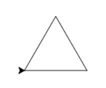
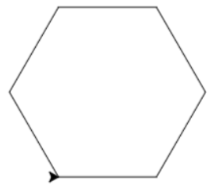
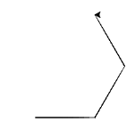
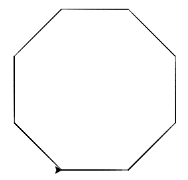
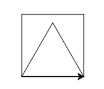
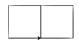
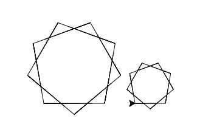

## Oefenproefwerk Module 2

Lees eerst dit:

- Lees de codes goed! Je weet dat kleine dingen zoals dubbele punten en komma's uitmaken.
- Als je code moet opschrijven, schrijf dan netjes. Onleesbare antwoorden zijn foute antwoorden.
- Denk ook aan spaties bij lussen en if's. Due moet je ook opschrijven, door iets verder op de regel te beginnen.


1) Wat tekenen deze codes? 

**Let op! De codes kunnen ook fout zijn! Schrijf dan FOUT.**

```python
1.
for i in range(6)
  pen.forward(100)
  pen.left(60)
```

```python
2.
aantal_keer = 6
grootte = 100
for i in range(4):
  pen.forward(100)
pen.left(60)
```
```python
3.
aantal_hoeken = 8
hoek = 360/aantal_hoeken
for i in range(aantal_hoeken):
  pen.forward(50)
  pen.left(hoek)
```

```python
4.
for i in range(4):
  pen.forward(100)
  pen.left(90)
```

```python
5.
for i in range(4):
  pen.forward(100)
  pen.left(90)
```

```python
6.
for i in range(4):
  pen.forward(100)
  pen.left(90)

for i in range(3):
  pen.forward(100)
  pen.left(120)
```

```python
7.
for i in range(3):
  pen.forward(100)
  pen.left(120)
  
pen.forward(100)

for i in range(3):
  pen.forward(100)
  pen.left(120)
```

```python
8.
for i in range(4):
  pen.forward(100)
  pen.left(90)

pen.penup()
pen.forward(100)
pen.pendown()

for i in range(4):
  pen.forward(100)
  pen.left(90)
```


```python
9.
for i in range(3):
  pen.forward(100)
  pen.left(60)

pen.forward(100)

for i in range(3):
  pen.forward(100)
  pen.left(60)
```

```python
10.
for i in range(6):
  pen.forward(100)
  pen.left(60)

pen.penup()
pen.forward(150)
pen.pendown()

for i in range(3):
  pen.forward(100)
  pen.left(120)
```


2) Welke codes horen bij deze tekeningen? 


1. 
2. 
3. 
4. 
5. 
6. 
7. 

3) Wat doen deze codes? Leg het in woorden uit. 

**Let op: Er kunnen nu ook foutjes in de codes zitten! Schrijf dan FOUT!**	

Voorbeeld!

```python
hoek = 60
for i in range(6):
  pen.forward(50)
  pen.left(hoek)
  
hoek = 90
for i in range(4):
  pen.forward(50)
  pen.left(hoek)
```

Jouw antwoord: "Deze code tekent een zeshoek, en daarna op dezelfde plek een vierkant."

```python
4.
aantal_keer = 6
for i in range(aantal_keer):
  pen.forward(100)
  pen.left(60)
```

```python
5.
aantal_keer = 6
hoek = 60
for i in range(aantal_keer):
  pen.forward(50)
  pen.left(hoek)
```

```python
6.
aantal_hoeken = 3
hoek = 360/aantal_hoeken
for i in range(aantal_hoeken):
  pen.forward(50)
  pen.left(hoek)
```

```python
7.
aantal_keer = 4
for i in range(aantal_keer):
  pen.forward(100)
  pen.left(90)
```
```python
8.
aantal_keer = 4
for i in range(aantal_hoeken)
  pen.forward(100)
  pen.left(90)
```

```python
9.
aantal_keer = 6
grootte = 100
for i in range(4):
  pen.forward(100)
  pen.left(60)
```

```python
10.
aantal_keer = 5
hoek = 72
for i in range(aantal_keer):
  pen.forward(100)
  pen.left(hoek)
```

```python
11.
aantal_hoeken = 8
hoek = 360/aantal_hoeken   # / betekent gedeeld door in Python
for i in range(aantal_hoeken):
pen.forward(50)
pen.left(hoek)
```

```python
12.
hoeken = 3
for i in range(hoeken):
  pen.forward(100)
  pen.left(120)

pen.forward(100)

for i in range(hoeken):
  pen.forward(100)
  pen.left(120)
```

------

**Kleuren tekenen**

1) Welke kleur wordt dit? Tip: lagere getallen zijn donkerder, niet lichter!

```python
1. pen.color(255, 0, 0)
2. pen.color(0, 255, 0)
3. pen.color(255, 255, 0)
4. pen.color(255, 0, 0)
5. pen.color(255, 0, 255)
6. pen.color(160, 0, 0)
7. pen.color(160, 0, 0)
8. pen.color(160, 160, 0)
9. pen.color(0, 160, 0)
10.pen.color(160, 0, 160)
```

