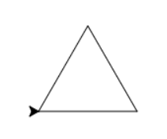
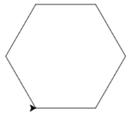
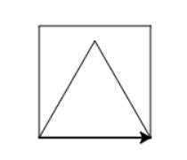

### Meerdere figuren

**Even opfrissen**

Vorige week maakten we kennis met de `for` lus. Hoe ging dat ook al weer?

1) Wat tekenen deze codes? 

Let op! De codes kunnen ook fout zijn! Schrijf dan FOUT.

```python
1.
for i in range(3):
  pen.forward(100)
  pen.left(120)
```

```python
2.
for i in range(6)
  pen.forward(100)
  pen.left(60)
```
```python
3.
for i in range(3):
pen.forward(100)
pen.left(90)
```

```python
4.
for i in range(4):
  pen.forward(100)
  pen.left(90)
```

```python
5.
for i in range(4):
  pen.forward(100)
  pen.left(90)
```


2) Welke code hoort bij deze tekeningen? 


1. 
2. 
3. 
4. 

------

Einde werkblad! Ben je klaar, leg dan je schrift bovenaan op je tafel.

 <div style="page-break-after: always;"></div>

**Meerdere figuren**

1) Wat tekenen deze codes?

```python
1.
for i in range(4):
  pen.forward(100)
  pen.left(90)

for i in range(3):
  pen.forward(100)
  pen.left(120)
```

```python
2.
for i in range(3):
  pen.forward(100)
  pen.left(120)
  
pen.forward(100)

for i in range(3):
  pen.forward(100)
  pen.left(120)
```

```python
3.
for i in range(4):
  pen.forward(100)
  pen.left(90)

pen.penup()
pen.forward(100)
pen.pendown()

for i in range(4):
  pen.forward(100)
  pen.left(90)
```

```python
4.
for i in range(3):
  pen.forward(100)
  pen.left(60)

pen.forward(100)

for i in range(3):
  pen.forward(100)
  pen.left(60)
```


```python
5. (Ja deze code is echt anders dan de code van 4 hoor. Kijk goed!)
for i in range(3):
  pen.forward(100)
  pen.left(120)

pen.forward(50)

for i in range(3):
  pen.forward(100)
  pen.left(120)
```
```python
6.
for i in range(6):
  pen.forward(100)
  pen.left(60)

pen.penup()
pen.forward(150)
pen.pendown()

for i in range(3):
  pen.forward(100)
  pen.left(120)
```


**Extraatje!**

Welke codes horen bij deze tekeningen? Gebruik natuurlijk wel een lus (of meerdere lussen).

1. 
2. 
3. 
4. 