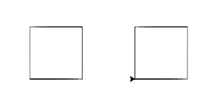
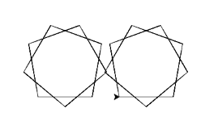
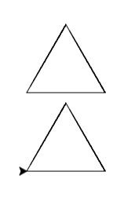
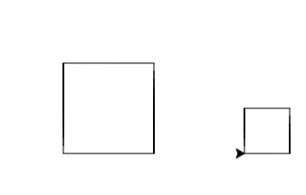

### Opdracht 4b-1) Maak twee vierkanten met 1 variabele

Deze les wordt afgetekend als:

- Je twee vierkanten naast elkaar hebt getekend
- Je een variabele gebruikt voor de **hoek**


Denk aan deze tips:

- Maak de opdracht eerst zonder variabele. Kijk dan waar je het getal 90 ziet. Dat moet worden vervangen door de variabele hoek.
- Vergeet ook de dubbele punt :  aan het einde van de `for` niet.
- En begin met twee spaties onder de `for`!

### Opdracht 4b-2) Maak twee vierkanten met 2 variabelen

Deze les wordt afgetekend als:

- Je twee vierkanten naast elkaar hebt getekend (precies zoals bij opdracht 1)
- Je een variabele gebruikt voor de **hoek**
- Je een variabele gebruikt voor het **aantal hoeken**


 <div style="page-break-after: always;"></div>
### Opdracht 4b-3) Maak twee spirografen met 2 variabelen

Deze les wordt afgetekend als:

- Je twee spirograaffiguren naast elkaar hebt getekend
- Je een variabele gebruikt voor de **hoek**
- Je een variabele gebruikt voor het **aantal hoeken**



### Opdracht 4b-4) Maak twee driehoeken op elkaar met 2 variabelen

Deze les wordt afgetekend als:

- Je twee driehoeken onder elkaar hebt getekend
- Je een variabele gebruikt voor de **hoek**
- Je een variabele gebruikt voor het **aantal hoeken**


 <div style="page-break-after: always;"></div>
### Opdracht 4b-5) Maak twee driehoeken op elkaar met 3 variabelen

Deze les wordt afgetekend als:

- Je twee driehoeken onder elkaar hebt getekend
- Je een variabele gebruikt voor de **hoek**
- Je een variabele gebruikt voor het **aantal hoeken**
- Je een variabele hebt gebruikt voor de **grootte** van de driehoeken


### Opdracht 4b-6) Maak twee vierkanten, eentje klein (3 variabelen)

Deze les wordt afgetekend als:

- Je twee vierkanten naast elkaar hebt getekend
- De tweede half zo groot is als de eerste
- Je een variabele gebruikt voor de **hoek**
- Je een variabele gebruikt voor het **aantal hoeken**
- Je een variabele hebt gebruikt voor de **grootte** van de driehoeken

Tip: gebruik de variabele grootte nu twee keer.


 <div style="page-break-after: always;"></div>
### Opdracht 4b-7) Maak ieder figuur!

Nu willen we een figuur maken dat we kunnen instellen door maar één variabele te veranderen. Dus als we `aantal_hoeken` op 3 zetten komt er een  driehoek en `aantal_hoeken = 10` maakt een tienhoek etc. Daarvoor moet je rekenen met de variabele. Een beginnetje voor de code staat hieronder. Met deze code moet je een vierkant krijgen.

**Opdracht.** Maak deze code af door op de stippeltjes de juiste codes in te vullen.

```python
aantal_hoeken = 4
hoek = .......

for i in range(...):
    pen.left(hoek)
    pen.forward(100)
```

**Let op!** Je krijgt alleen een stempel als je het figuur kunt veranderen door alleen de regel met `aantal_hoeken` aan te passen.

### Opdracht 4b-8) Maak je eigen figuur

Deze opdracht kun je zo vaak doen als je wilt, dus je kunt er zoveel stempels mee halen als je wilt. 
De opdracht gaat zo:

1. Je tekent een figuur in je schrift, het mag ieder figuur zijn dat minstens uit 2 delen bestaat.
2. Dit figuur laat je aftekenen (doe een gele post-it op je scherm).
3. Nu maak je de code voor het figuur.

Maar… anders dan vorige week moet je nu in je figuren ook variabelen gebruiken.

Let op! Het telt alleen als je eerst tekent en dan pas code maakt!